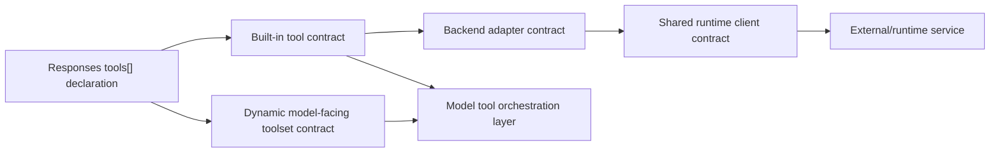

# ADR-03: Gateway-owned tool interface contracts

> **Status:** Draft

## Intention

Define the gateway-owned tool interface contracts for `agentic-apis`, so new Responses API tools can be added
without coupling each tool directly to model transport, provider-specific tool calling, or the public streaming
composer.

This ADR focuses on the contract shape for building tools:

- which tool interface types the gateway should support
- what each interface is good for
- what trade-offs each interface creates
- what minimum work is required for `code_interpreter`, `web_search`, hosted MCP, remote MCP, and `file_search`

The goal is to extract the durable decision points needed to start implementing tools with stable boundaries.

## Context

Responses API tools are not all the same kind of thing.

Some tools are stable product features owned by the gateway, such as `code_interpreter` or `web_search`. The model
should see a stable model-facing tool contract even if the gateway changes the backend later.

Other tools are dynamic external inventories, such as MCP tools discovered from a hosted or request-declared server.
In those cases, the model may need to see the discovered tool names, descriptions, and JSON schemas directly.

There is also a third case: a stable gateway-owned tool may use a backend that is itself a toolset. For example,
`web_search` may use an MCP server such as Exa or Fetch as a backend, while still exposing only the stable
`web_search` contract to the model.

Without explicit interface categories, tool designs tend to collapse several concerns together:

- model-facing tool schema
- public Responses request declaration
- backend provider selection
- runtime/session lifecycle
- argument validation
- execution error mapping
- output item construction
- include-gated response expansion

That coupling makes the first tool easy and the second tool harder. It also makes provider replacement risky because
the model-facing contract and backend execution details drift together.

## Terminology

This ADR uses a small set of tool terms:

- **Built-in tool**: a stable gateway-owned tool such as `code_interpreter`, `web_search`, or `file_search`.
- **Model-facing tool contract**: the tool name, description, and argument schema visible to the model.
- **Dynamic toolset**: a set of discovered tools exposed directly to the model, such as MCP tools from a server.
- **Backend**: the mechanism that fulfills a tool action behind the gateway contract.
- **Managed MCP backend**: an MCP server or toolset managed by the gateway and used either directly or behind a
  built-in tool.
- **Tool-owned adapter**: a narrow wrapper around a pydantic-ai function tool or common tool used by a built-in tool
  when the backend should not be exposed directly to the model.

## Scope

This ADR is intended to support discussion and eventually settle the MVP direction for:

1. gateway-owned tool interface categories
2. model-facing tool contracts vs backends
3. built-in tools
4. dynamic model-facing toolsets
5. backend adapters behind built-in tools, focused on managed MCP and tool-owned pydantic-ai function/common-tool
   adapters
6. shared runtime clients for managed MCP backends

This ADR does not attempt to settle:

- exact Python class names or module layout
- final streaming event normalization details
- final persistence semantics for tool calls and tool outputs
- full security policy for sandboxed execution or remote network access
- final hosted MCP deployment topology
- provider-specific search ranking or citation policy

## Proposed discussion frame

The current proposal is to evaluate gateway-owned tools through four interface categories:

These are not yet accepted decisions. They are the candidate boundaries this ADR proposes for review:

| # | Candidate boundary | Question to resolve |
|---|--------------------|---------------------|
| C1 | Built-in tools | Which tools should have stable gateway-owned model-facing contracts? |
| C2 | Dynamic model-facing toolsets | Which tools should expose discovered external tool inventory directly to the model? |
| C3 | Backend adapters | Which built-in tools need interchangeable managed MCP or pydantic-ai function/common-tool backends? |
| C4 | Shared runtime clients | Which managed MCP backends need lifecycle isolation, process sharing, or centralized inventory/status? |

## Interface categories

### 1. Built-in tool

A built-in tool is a stable, model-facing tool owned by the gateway.

Use this interface when:

- the public tool type is part of the product contract
- the model should see one stable tool name and argument schema
- backend may change without changing the model-facing contract
- the gateway must own request policy, output shape, and include-gated fields

Examples:

- `code_interpreter`
- `web_search`
- `file_search`

The contract should include:

- public Responses tool declaration
- canonical tool name
- model-facing argument schema
- request admission and duplicate validation
- request-scoped runtime construction, if needed
- async execution against typed arguments
- typed execution result
- mapping from result to the tool's Responses output item family

What it is good for:

- stable public API
- stable model prompt/tool schema
- backend replacement without model-contract churn
- hiding provider-specific tool names and provider-specific schemas
- centralizing include gates and response item shape

### 2. Dynamic model-facing toolset

A dynamic model-facing toolset exposes discovered tools directly to the model.

Use this interface when:

- the tool inventory is not known until request time or runtime startup
- the model should choose among externally defined tools
- each discovered tool has its own name, description, and JSON schema
- the gateway is primarily brokering access rather than defining a stable product-level abstraction

Examples:

- hosted MCP exposed as `tools[].type="mcp"`
- remote MCP exposed as `tools[].type="mcp"` with a request-declared server URL

The contract should include:

- server declaration and policy validation
- tool inventory discovery
- stable internal naming and collision handling
- schema normalization and validation
- dynamic tool listing for the model orchestration layer
- dynamic tool execution by name
- structured success/failure result wrapping
- secret redaction and transport error mapping

What it is good for:

- direct access to dynamic external tool ecosystems
- minimal gateway-specific wrapping per external tool
- preserves external tool names, descriptions, and schemas
- supports request-scoped inventories

### 3. Backend adapter behind a built-in tool

A backend adapter is not model-facing. It is an interface used by a built-in tool to use a backend without exposing
that backend directly to the model.

Use this interface when:

- the model-facing contract should stay stable
- different providers can satisfy the same built-in action
- the backend can be represented as managed MCP or a tool-owned pydantic-ai function/common-tool adapter
- provider-specific HTTP APIs, SDKs, databases, object stores, or local libraries are wrapped inside the adapter rather
  than becoming model-facing contracts
- the gateway needs provider replacement, fallback, or profile selection while keeping the backend surface small

Examples:

- `web_search` using an Exa managed-MCP search adapter
- `web_search` using a pydantic-ai common-tool DuckDuckGo adapter for search and a managed-MCP Fetch adapter for
  `open_page`

The contract should include:

- action name supported by the adapter
- managed MCP server labels, when the adapter uses managed MCP
- provider-specific argument construction
- provider-specific result parsing
- normalized internal action result
- provider error normalization

What it is good for:

- keeps the model-facing built-in stable
- allows provider/profile replacement
- allows one built-in to compose several backend actions
- isolates provider parsing and quirks
- allows MCP to be used as a backend mechanism without becoming the public tool contract

### 4. Shared runtime client

A shared runtime client isolates managed MCP lifecycle from request handling.

Use this interface when:

- a managed MCP backend session is expensive or long-lived
- multiple gateway workers need shared access to managed MCP
- the managed MCP helper process must be supervised
- MCP tool inventory should be cached or refreshed centrally
- MCP startup failures need a single inspectable status

Examples:

- managed MCP runtime client

The contract should include:

- health/status checks
- list servers or capabilities, where relevant
- list tools, where relevant
- call tool or execute action
- structured transport errors
- structured execution errors
- timeout policy
- secret redaction boundary

What it is good for:

- avoids starting duplicate helper runtimes in each worker
- centralizes lifecycle and startup failure reporting
- simplifies multi-worker deployments
- gives built-ins a small backend-facing API

## Discussion rationale

The main reason to discuss these categories is that tool design mixes two questions that are easy to conflate:

1. What tool contract should the model see?
2. What backend mechanism fulfills that contract?

For `code_interpreter`, the likely direction is a stable model-facing code execution tool, while the gateway chooses
how to sandbox and execute code.

For `web_search` or `file_search`, the distinction matters more. A provider may expose an MCP tool, an HTTP API, an
SDK, a vector database, an object store, or a local adapter. This ADR frames built-in backend execution around managed
MCP and tool-owned pydantic-ai function/common-tool adapters. Wrapping provider-specific mechanisms inside an adapter
keeps provider choice out of the public/model-facing contract while still allowing the gateway to own action semantics,
output shape, and include behavior.

For MCP, the distinction may flip. The point of MCP is often to expose external tool inventories. In that case, a
dynamic toolset may be the right model-facing contract, provided the gateway still owns admission, naming, schema
validation, execution policy, and error mapping.

This suggests a working rule for discussion, not yet a final decision:

- use a built-in tool when the gateway owns the product abstraction
- use a dynamic toolset when the discovered backend inventory is the product abstraction
- use backend adapters when a built-in tool needs interchangeable managed MCP or pydantic-ai function/common-tool
  providers
- use runtime clients when managed MCP lifecycle should not live inside request handlers

## Consequences to evaluate

If the project adopts these categories, the likely consequences are:

- adding a new built-in tool would require a public declaration, model-facing schema, executor, typed result, and
  response adapter
- adding a new backend for an existing built-in should usually avoid changing the model-facing tool schema
- adding a dynamic tool provider would require inventory discovery, schema validation, naming, and execution routing
- MCP could be used either as a model-facing dynamic toolset or as a hidden managed backend adapter
- pydantic-ai function/common-tool adapters could cover direct local or library-backed built-in execution
- managed MCP runtime/session lifecycle could be centralized without forcing every tool to know how that lifecycle works
- tool executors would ideally avoid constructing final Responses streams directly
- include-gated fields would likely be handled at the response adapter/composition boundary
- error handling policy would differ by interface type: built-in tools can provide product-specific errors, while
  dynamic toolsets need robust wrapping around external volatility

These consequences need review before acceptance. In particular, the committee should decide whether these categories
are sufficient for the MVP and whether the proposed managed-MCP plus pydantic-ai function/common-tool adapter framing
keeps the implementation surface small while preserving provider replacement.
